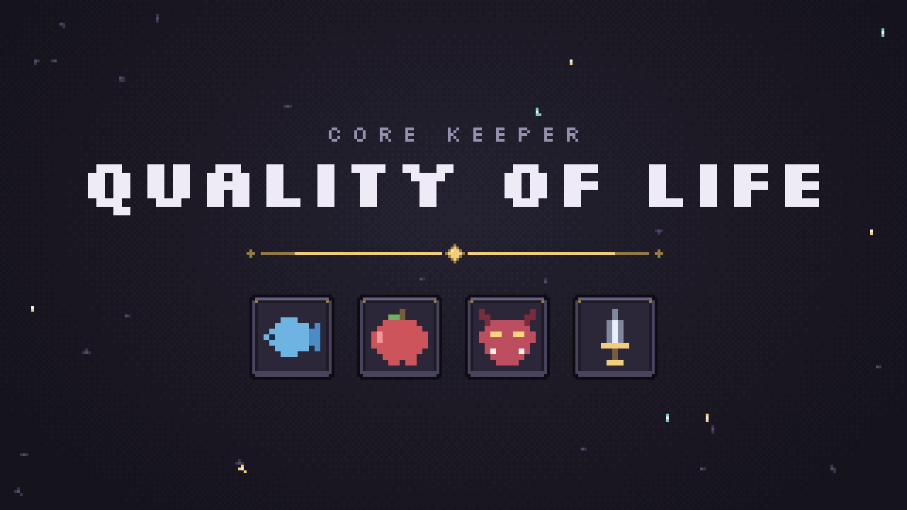

# Core Keeper QoL

Client-side quality-of-life tweaks, bundled as one PugMod mod. Other players do not
need it.

Settings live in the game's own menu: **Settings → QoL settings**. Every feature is
on out of the box and has an Enabled toggle to switch it off.

Targets Core Keeper **1.2.1.5**.

## Features

**Auto Fishing** — casts and hooks for you, and stops baited spots depleting.

**Auto Eat** — eats when hunger passes a threshold, without changing the item you
have selected. Picks the smallest food that helps.

**Auto Summon** — keeps minions up as they expire or die, never past your cap.
Ctrl+R with a summoning weapon in hand toggles it for the session.

**DPS Tracker** — your damage per second, under the minion counter. Detailed mode
breaks it down by source, each with its icon.

**Chest Search** — start typing in the box beside the inventory and every
nearby chest, station, pouch and dropped stack holding that item is listed with a
count, and outlined in the world in a colour for how much is in there.

## Install

```sh
./check.sh && ./install.sh
```

Close the game first — mods are compiled at startup.

Installs to `CoreKeeper_Data/StreamingAssets/Mods/CkQol/`; set `CK_GAME_DIR` if the
game lives elsewhere. Steam wipes that folder on updates and on Verify Integrity, so
re-run `install.sh` if the mod stops loading.

Settings are saved under `…/Pugstorm/Core Keeper/Steam/<id>/mods/CkQol/`. Delete that
folder to reset everything.

## Releasing

Tagging is the trigger:

```sh
./check.sh                       # CI has no game assemblies, so it cannot compile
git tag -a v1.0.0 -m "what changed"
git push origin v1.0.0
```

That builds the zip, attaches it to a GitHub release, and syncs the mod.io page —
copy, logo, screenshots, tags and the download — from this repo. The tag message
becomes the changelog. Needs two repository secrets: `MODIO_TOKEN` (a
**write**-scoped token from <https://mod.io/me/access>) and `MODIO_MOD_ID`.

`assets/make-logo.py` draws the store logo; `assets/screenshots/` is the store
gallery, one file per image.

## Development

`check.sh` compiles against the game's assemblies and lints for the APIs PugMod's
security verifier rejects — worth running, because a mod that fails either only says
"Compilation failed" in `Player.log`, hours of guessing later.

To add a feature, write a class in `src/Features/` extending `QolFeatureBase` and
register it in `CkQolMod.BuildFeatures`. It gets a settings page for free.

[NOTES.md](NOTES.md) is the long version: how each feature works, what the game's
API allows, and the traps that cost a day each.

## License

MIT — see [LICENSE](LICENSE).

`assets/fonts/` is [Silkscreen](https://github.com/googlefonts/silkscreen) under the
SIL Open Font License, not MIT; its licence sits beside it.
